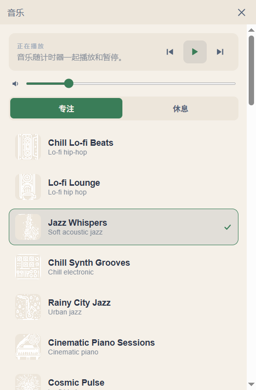

<div align="center">

# Elegant Pomodoro

English | [简体中文](./README.zh-CN.md)

**A visually-pleasing Pomodoro timer with FlowTunes music channels and ambient
sound mixing.**

<br>


&nbsp;&nbsp;&nbsp;


</div>

---

## Overview

Elegant Pomodoro combines a classic circular-dial Pomodoro timer with the music
experience of [FlowTunes](https://flowtunes.app): 41 AI-music channels streamed
live while you focus, a separate channel for breaks, and an ambient-sound mixer
with per-sound volume. Pause the timer and the music pauses with it.

It started as a fork of [Pomotroid](https://github.com/Splode/pomotroid) — all
of Pomotroid's timer features are still on board.

## Features

**Timer**

- Drift-corrected engine on a dedicated OS thread — long sessions stay accurate
- Work / short break / long break with configurable round counts
- Auto-start of next rounds, restart current round, skip
- System tray with live progress arc
- Session statistics: daily heatmap, hourly bar chart, focus streaks

**Music & ambient sound**

- 41 FlowTunes channels (6,700+ tracks) streamed directly — nothing to download
- Separate channels for focus and break rounds, with automatic switching
- Optional auto-play on break; transport controls in the music panel
- 65 ambient sounds (rain, fireplace, birdsong…) with individual volume, mixed
  over the music
- Playback pauses / resumes / stops together with the timer

**Everything else**

- 38 built-in themes plus hot-reloading custom themes — see [THEMES.md](THEMES.md)
- Interface in 8 languages (English, 简体中文, Deutsch, Español, Français,
  日本語, Português, Türkçe)
- Global and in-app keyboard shortcuts (configurable)
- Opt-in local WebSocket server exposing the live timer state for integrations
- Custom alert sounds, compact mode, per-window position memory

## Download

Grab an installer or a portable executable from
[Releases](../../releases). Windows builds are produced per tag; Linux and
macOS artifacts are built by CI as well. Binaries are **unsigned** — expect a
SmartScreen / Gatekeeper warning on first launch.

## Build from source

Prerequisites: [Node.js](https://nodejs.org) ≥ 22, npm, and the
[Rust](https://rustup.rs) stable toolchain (plus a C/C++ build toolchain, e.g.
Visual Studio Build Tools on Windows).

```sh
npm install
npm run tauri dev      # run in development
npm run tauri build    # produce installers in src-tauri/target/release/bundle/
```

## Music data notice

The bundled channel catalog and the streamed audio belong to
[FlowTunes](https://flowtunes.app) and are used here for personal,
non-commercial purposes. If you enjoy the music, please support the original
service. Open an issue before redistributing this data elsewhere.

## License

Elegant Pomodoro is [MIT](LICENSE) licensed.

- Timer core and design language: forked from
  [Pomotroid](https://github.com/Splode/pomotroid) © 2018 Christopher Murphy.
- FlowTunes channel data and streamed audio: © FlowTunes (see notice above).
